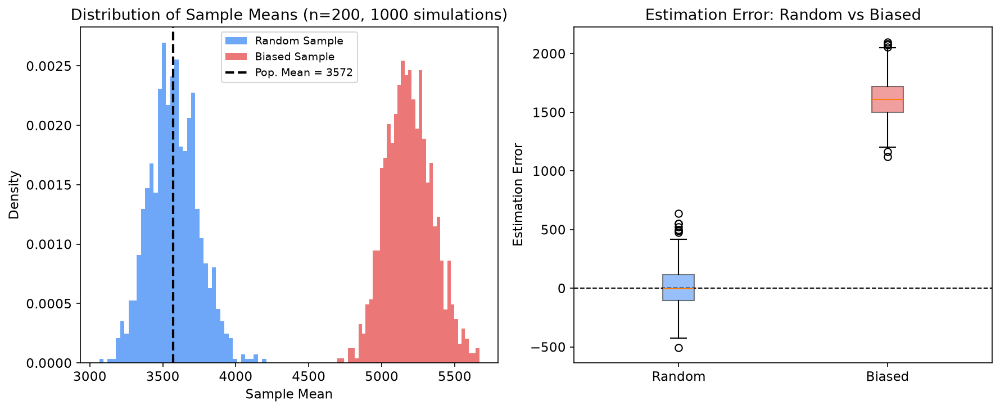

1936년 미국 대선. 시사 잡지 *Literary Digest*는 우편 설문지 약 1,000만 통을 발송해 그중 약 240만 통을 회신받았다. 역사상 가장 거대한 규모의 여론조사였고, 결론은 공화당 후보 Alf Landon의 압승이었다. 실제 결과는 정반대였다. Franklin Roosevelt가 48개 주 가운데 46개를 가져가며 역대급 압승을 거뒀다. 반면 신생 여론조사 기관이던 George Gallup은 고작 50,000명의 표본으로 Roosevelt의 승리를 맞혔다.

240만 대 5만. 왜 숫자가 48배 많은 쪽이 틀렸을까? 두 가지 편향이 겹쳤다. 첫째, *Literary Digest*는 자사 구독자, 전화번호부, 자동차 등록부에서 설문 대상을 뽑았다. 대공황 한복판이던 1936년에 전화와 자동차를 가진 사람은 상대적으로 부유한 계층이었고 공화당을 지지할 확률이 높았다(표집틀 편향). 둘째, 회신율이 약 24%에 그쳤고 그 회신마저 무작위가 아니었다. 자동차와 전화를 모두 보유한 집단 안에서조차 Landon 지지자가 훨씬 높은 비율로 답장을 보냈다(무응답 편향). 표본과 응답이 모두 편향되어 함께 오차를 만든 것이다. 표본의 크기보다 표본의 대표성이 중요하다.

## 모집단과 표본

| 용어 | 정의 | 예시 |
|---|---|---|
| **모집단(Population)** | 관심 대상 전체의 집합 | 한국의 성인 전체 |
| **표본(Sample)** | 모집단에서 추출한 부분집합 | 설문에 응답한 1,000명 |
| **모수(Parameter)** | 모집단의 특성을 나타내는 고정 상수 | 모집단 평균 $\mu$, 비율 $p$ |
| **통계량(Statistic)** | 표본에서 계산한 값 | 표본 평균 $\bar{X}$, 표본 비율 $\hat{p}$ |

모집단 전체를 조사하는 것을 **전수조사**(Census)라 한다. 비용과 시간, 파괴 검사(전구 수명을 전수로 측정하면 팔 전구가 남지 않는다), 아직 존재하지 않는 무한 모집단("이 약을 복용할 미래의 모든 환자") 때문에 전수조사는 대개 불가능하다. 그래서 표본을 뽑는다. 추정량이 비편향이 되려면 "표본이 모집단으로부터 적절히 추출되었다"는 가정이 반드시 깔려 있어야 한다.

## 확률적 표본 추출법(Probability Sampling)

확률적 표본 추출에서는 모집단의 모든 원소가 표본에 포함될 확률이 알려져 있고 0보다 크다. 이 조건을 만족해야 통계적 추론이 정당화된다.

| 방법 | 설명 | 장점 | 단점 | 적합한 상황 |
|---|---|---|---|---|
| **단순 무작위 추출(SRS)** | 모든 원소가 동일한 확률로 선택 | 이론이 단순, 편향 없음 | 표본 프레임 필요, 희귀 하위그룹 누락 가능 | 모집단이 균질할 때 |
| **층화 추출(Stratified)** | 모집단을 층(strata)으로 나눈 뒤 각 층에서 독립 추출 | 층 내 변동 줄임, 소수 그룹 보장 | 층 구분 기준 필요 | 하위 그룹 분석이 중요할 때 |
| **군집 추출(Cluster)** | 모집단을 군집으로 나누고 군집 단위로 추출, 선택된 군집은 전수조사 | 표본 프레임 구축 비용 절감 | 군집 간 유사하면 효율 떨어짐 | 지리적으로 분산된 모집단 |
| **체계적 추출(Systematic)** | 첫 번째 원소만 무작위, 이후 $k$번째 간격으로 추출 | 구현이 쉬움 | 주기성이 있으면 편향 발생 | 리스트가 무작위 순서일 때 |

단순 무작위 추출은 크기 $N$인 모집단에서 크기 $n$인 표본을 뽑을 때 가능한 모든 $\binom{N}{n}$ 조합이 동일한 확률을 갖는 방법이다. 기댓값 수준에서 모집단 평균을 편향 없이 추정하지만, 뽑을 때마다 표본 평균은 달라진다. 이 변동성이 표준오차(Standard Error)다.

층화 추출은 성별, 연령대, 지역 같은 기준으로 모집단을 나누고 각 층에서 독립적으로 뽑는다. 전체 직원 10,000명 중 관리직 2,000명, 실무직 8,000명이라면 관리직에서 20명, 실무직에서 80명을 따로 뽑는 식이다. 층 내 분산이 작을수록 전체 추정량의 분산이 줄어든다.

$$\text{Var}(\bar{X}_{str}) = \sum_{h=1}^{H} \left(\frac{N_h}{N}\right)^2 \frac{\sigma_h^2}{n_h}$$

여기서 $H$는 층의 수, $N_h$는 $h$번째 층의 모집단 크기, $\sigma_h^2$는 층 내 분산, $n_h$는 층별 표본 크기다.

## 비확률적 표본 추출법(Non-Probability Sampling)

비확률적 방법에서는 각 원소가 선택될 확률을 알 수 없다. 통계적 추론의 전제가 무너지므로 결과를 모집단으로 일반화하기 어렵다. 그럼에도 현실에서는 빈번히 쓰인다.

| 방법 | 설명 | 위험 |
|---|---|---|
| **편의 추출(Convenience)** | 접근하기 쉬운 대상을 표본으로 선택 | 모집단의 특정 부분만 반영. 웹 팝업 설문, SNS 투표, 앱 내 만족도 조사가 전형적이며 응답자가 "그 서비스를 쓰는 사람"으로 한정된다 |
| **판단 추출(Purposive)** | 연구자의 판단으로 "대표적인" 대상을 선택 | 연구자의 편견이 개입 |
| **눈덩이 추출(Snowball)** | 기존 응답자가 다음 응답자를 추천 | 동질적 네트워크로 편향 |

## 편향의 유형

표본이 모집단을 체계적으로 잘못 반영할 때 **편향**(Bias)이 발생한다. 편향은 표본 크기를 아무리 늘려도 사라지지 않는다. 이것이 무작위 오차(random error)와의 결정적 차이다.

| 편향 유형 | 핵심 메커니즘 | 대표 사례 |
|---|---|---|
| 선택 편향 | 표본이 모집단의 특정 부분집합에 치우침 | Literary Digest (1936) |
| 생존자 편향 | 탈락하거나 실패한 데이터가 누락 | 펀드 수익률, 성공 기업 분석 |
| 응답 편향 | 응답자가 실제와 다르게 답함 | 음주량 설문 |
| 자기선택 편향 | 참여 여부를 본인이 결정하고 그 결정이 결과와 상관 | 온라인 리뷰 |

**선택 편향**의 현대적 사례로 병원 기반 연구가 있다. "특정 질병의 위험 요인"을 병원 방문 환자만으로 분석하면 경증 환자(오지 않는)와 중증 환자(이미 사망한)가 빠진다. 여기서 한 걸음 더 들어간 것이 **버크슨 편향**(Berkson's Bias)이다. 질환 A와 B가 각각 입원 확률을 올린다고 하자. 모집단에서 두 질환이 서로 무관해도, 입원 환자만 놓고 보면 A가 없는 환자는 B 때문에 왔을 가능성이 높아진다. 그래서 입원 집단 안에서만 두 질환 사이에 음의 연관이 나타난다. 표본을 고른 기준이 원인 둘의 공통 결과일 때, 없던 상관이 만들어지는 것이다.

**응답 편향**은 소득, 음주량, 투표 성향처럼 민감한 주제에서 특히 심하다. "일주일에 술을 몇 잔 마시는가?"에 대한 응답을 전부 합산해도 실제 주류 판매량의 40~60%밖에 되지 않는다는 연구가 여러 차례 보고되었다.

**자기선택 편향**은 제품 리뷰에서 뚜렷하다. 매우 만족하거나 매우 불만족한 사람이 리뷰를 남기고 보통인 사람은 침묵한다. 그래서 리뷰 분포는 실제 만족도 분포와 다른 양극화된 형태를 띤다.

**생존자 편향**은 살아남은 사례만 관측 가능할 때 발생한다.

- "하버드 중퇴자 중에 억만장자가 많다": 하버드를 중퇴한 수십만 명 중 빌 게이츠, 저커버그만 보인다.
- "자수성가 CEO들이 공통으로 새벽 5시에 일어난다": 새벽 5시에 일어났지만 실패한 사람은 기사가 되지 않는다.
- 뮤추얼 펀드의 평균 수익률이 실제보다 높게 보고된다: 수익률이 나빴던 펀드는 폐쇄되어 데이터에서 사라진다.

## 에이브러햄 왈드와 비행기 장갑

제2차 세계대전 중 통계학자 에이브러햄 왈드(Abraham Wald)는 컬럼비아대 통계연구그룹(Statistical Research Group)에서 항공기 생존성 문제를 다뤘다. 귀환한 항공기의 피탄 분포로부터 어느 부위에 장갑을 보강해야 하는지를 추정하는 문제였다.

직관적인 답은 단순하다. 총알 구멍이 많이 뚫린 부분에 장갑을 대라. 동체와 날개에 구멍이 집중되어 있으니 그쪽을 보강하자는 논리다. 그러나 왈드가 세운 모형을 따르면 결론이 뒤집힌다. 분석 대상은 **귀환한** 비행기다. 동체에 총을 맞고도 돌아올 수 있었다는 뜻이다. 엔진에 총을 맞은 비행기는 돌아오지 못했고, 그래서 데이터에 없다. 구멍이 적게 관측되는 부위야말로 피격 시 치명적인 부위이므로 그쪽을 보강해야 한다는 결론이 나온다.

널리 퍼진 "왈드가 군에 엔진을 보강하라고 말했다"는 일화는 공개된 왈드의 메모에서 확인되지 않는다. 메모는 순수하게 기술적이고 군에 대한 권고를 담고 있지 않다. 이 사례의 핵심은 일화가 아니라 방법론이다. 관측된 데이터에서 "빠진 것이 무엇인가?"를 묻는 것이 생존자 편향을 간파하는 열쇠다.

## 표본 크기 결정

표본이 편향 없이 추출되었더라도 크기가 너무 작으면 추정의 정밀도가 떨어진다. 중심극한정리에 따라 표본 평균의 표준오차는 $\text{SE}(\bar{X}) = \sigma / \sqrt{n}$이다. 표준오차가 $\sqrt{n}$에 반비례하므로 정밀도를 2배로 높이려면 표본 크기를 4배로 늘려야 한다.

95% 신뢰구간의 오차한계(Margin of Error, MOE)는 $\text{MOE} = z_{\alpha/2} \cdot \sigma / \sqrt{n}$이고, 이를 $n$에 대해 풀면 다음과 같다.

$$n = \left(\frac{z_{\alpha/2} \cdot \sigma}{\text{MOE}}\right)^2$$

비율 추정에서는 $\sigma$를 $\sqrt{p(1-p)}$로 대체한다. $p$를 모르면 분산이 최대인 $p = 0.5$를 쓰는 것이 보수적이다.

$$n = \frac{z_{\alpha/2}^2 \, p(1-p)}{\text{MOE}^2} = \left(\frac{z_{\alpha/2}}{2 \cdot \text{MOE}}\right)^2$$

```python
import numpy as np
from scipy import stats

def sample_size_mean(sigma, moe, confidence=0.95):
    """모평균 추정을 위한 최소 표본 크기"""
    z = stats.norm.ppf(1 - (1 - confidence) / 2)
    return int(np.ceil((z * sigma / moe) ** 2))

def sample_size_proportion(moe, confidence=0.95, p=0.5):
    """모비율 추정을 위한 최소 표본 크기 (보수적: p=0.5)"""
    z = stats.norm.ppf(1 - (1 - confidence) / 2)
    return int(np.ceil((z ** 2 * p * (1 - p)) / moe ** 2))

print(f"평균 추정(sigma=500, MOE=100): {sample_size_mean(500, 100)}명")
for moe_pct in [5, 3, 2, 1, 0.5]:
    print(f"  비율 추정 MOE=±{moe_pct}%p -> n = {sample_size_proportion(moe_pct / 100):,}")
# 평균 추정(sigma=500, MOE=100): 97명
#   비율 추정 MOE=±5%p -> n = 385
#   비율 추정 MOE=±3%p -> n = 1,068
#   비율 추정 MOE=±2%p -> n = 2,401
#   비율 추정 MOE=±1%p -> n = 9,604
#   비율 추정 MOE=±0.5%p -> n = 38,415
```

오차한계를 절반으로 줄이면 필요 표본 크기는 4배가 된다. 이 비선형 관계를 이해하면 "표본을 더 모으자"는 요구에 현실적인 비용을 제시할 수 있다.

## 편향된 표본은 얼마나 빗나가는가

지금까지의 이야기는 편향이 표본 크기와 무관하다는 주장이었다. 실제로 얼마나 빗나가는지 확인한다. 오른쪽 꼬리가 긴 연봉 분포를 모집단으로 놓고, 무작위 추출과 편향된 추출(중앙값 이상인 사람에서만 추출)을 각각 1,000번 반복한다.

```python
import numpy as np

np.random.seed(42)

N = 100_000
population = np.random.lognormal(mean=8.0, sigma=0.6, size=N)  # 연봉(만원)
pop_mean = np.mean(population)
median_pop = np.median(population)
upper_half = population[population >= median_pop]  # 부유층 편향 모집단

n_sim, n_sample = 1000, 200
means_srs, means_biased = [], []
for _ in range(n_sim):
    means_srs.append(np.mean(population[np.random.choice(N, n_sample, replace=False)]))
    means_biased.append(
        np.mean(upper_half[np.random.choice(len(upper_half), n_sample, replace=False)])
    )
means_srs, means_biased = np.array(means_srs), np.array(means_biased)

print(f"모집단 평균: {pop_mean:.0f}")
for name, m in [("무작위 추출", means_srs), ("편향된 추출(상위 50%)", means_biased)]:
    print(f"\n{name}")
    print(f"  표본 평균의 평균: {np.mean(m):.0f}")
    print(f"  편향(Bias): {np.mean(m) - pop_mean:.1f}")
    print(f"  표준오차(SE): {np.std(m, ddof=1):.1f}")
# 모집단 평균: 3572
#
# 무작위 추출
#   표본 평균의 평균: 3575
#   편향(Bias): 3.5
#   표준오차(SE): 166.9
#
# 편향된 추출(상위 50%)
#   표본 평균의 평균: 5188
#   편향(Bias): 1616.4
#   표준오차(SE): 160.5
```



*왼쪽: 표본 평균의 분포. 편향된 표본(빨강)은 모평균(검은 점선)에서 멀리 벗어나 있다. 오른쪽: 추정 오차 비교.*

무작위 추출의 편향은 3.5로 사실상 0인데, 상위 50%에서만 뽑으면 편향이 1,616에 달한다. 눈여겨볼 것은 두 방법의 표준오차가 166.9와 160.5로 거의 같다는 점이다. 편향된 표본도 정밀하기는 매한가지고, 다만 엉뚱한 값 주위에서 정밀할 뿐이다. 표본 크기를 200에서 2,000으로 늘려도 이 편향은 줄지 않는다. 표준오차(정밀도)는 표본을 늘리면 줄지만 편향(정확도)은 추출 방법 자체를 고치지 않는 한 사라지지 않기 때문이다. 1936년 *Literary Digest*의 실수와 정확히 같은 구조다.

## 실무 체크리스트

- **표본 프레임이 모집단을 완전히 커버하는가?** 전화번호부는 전화 없는 사람을, 이메일 목록은 이메일을 안 쓰는 사람을 놓친다.
- **무응답은 무작위인가?** 특정 집단이 체계적으로 응답을 거부하면 편향이 생긴다. *Literary Digest*를 무너뜨린 두 번째 원인이 이것이다.
- **생존자 편향이 숨어 있지 않은가?** "현재 데이터에 없는 것"이 무엇인지 반드시 질문하라.

## 마치며

표본의 대표성은 크기보다 중요하다. 편향된 240만 명보다 무작위 5만 명이 낫다. 편향은 표본 크기를 늘려도 사라지지 않으므로 추출 방법 자체를 바꿔야 한다. 그리고 데이터에서 "보이지 않는 것"을 의식적으로 찾아야 한다. 생존자 편향은 가장 교묘하고 가장 흔한 함정이다.

## 함께 보면 좋은 글

- [탐색적 데이터 분석과 기술통계](/stats/eda-descriptive-stats/)
- [큰 수의 법칙과 중심극한정리](/stats/lln-and-clt/)
- [점추정과 추정량의 성질](/stats/point-estimation/)
- [신뢰구간](/stats/confidence-intervals/)
- [부트스트랩](/stats/bootstrap/)
- [A/B 테스트 설계와 분석](/stats/ab-testing/)

## 참고자료

- Freedman, D., Pisani, R., & Purves, R. (2007). *Statistics* (4th ed.). W.W. Norton.
- Squire, P. (1988). Why the 1936 Literary Digest Poll Failed. *Public Opinion Quarterly*, 52(1), 125-133.
- Mangel, M. & Samaniego, F. J. (1984). Abraham Wald's Work on Aircraft Survivability. *Journal of the American Statistical Association*, 79(386), 259-267.
- Cochran, W. G. (1977). *Sampling Techniques* (3rd ed.). Wiley.
- Bethlehem, J. (2010). Selection Bias in Web Surveys. *International Statistical Review*, 78(2), 161-188.
